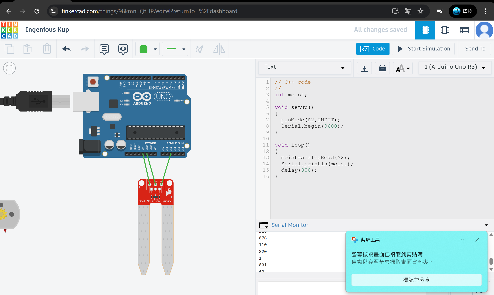
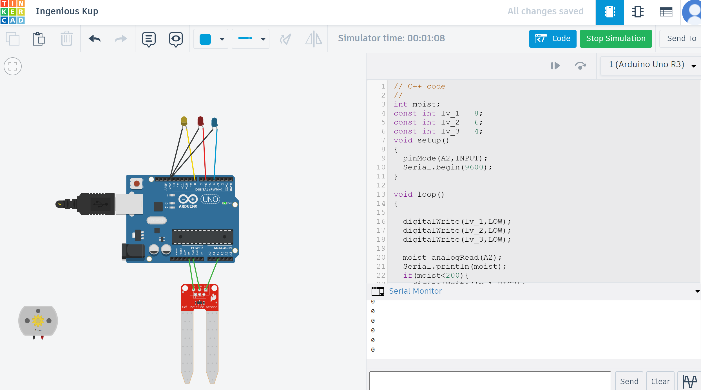

# 🌿 ESP32 永續農業智慧澆水系統

這是一個以 **永續農業（Sustainable Agriculture）** 為出發點，所設計的 **智慧自動澆水系統**。本專題結合 **ESP32 開發板** 與 **IoT 雲端平台**，實現低耗能、即時回饋的澆灌控制系統，致力於提升農業用水效率，並降低人力依賴。

---
## 📚 製作動機與理念
這是一個關於我在學習上的轉折，在高一的我投入大量的時間在研究機電整合(參加台中市機關王挑戰賽 機器人任務R4M 進階組獲得第一名/參加台灣區機關王挑戰賽 機器人任務R4M 進階組獲得全國佳作)，在備賽期間我學會了許多電子電路相關的技術，以及機械結構的製作，這也成為日後我在執行此專題時最大的技術支持。
高一的我生活是忙碌的，學習是充實的，除了機電整合外，我更投入於攀樹技術的精進，在親近大自然的同時，我深深體會到了自然與人的緊密連結，了解到或許**科技不該是征服自然，而是理解與融合**。因此，我與專精農業技術的爸爸討論了我的體悟，我決定透過自主學習**結合家裡的農業經驗**以及我**在機電整合上的學習**，打造出以**永續農業**為核心的**智慧澆水系統**。

---
## 📦 專案特色

- 🧠 **自動感測**：偵測土壤濕度，濕度過低自動啟動水泵。
- ☁️ **IoT 整合**：濕度數據上傳雲端，遠端即時查看。
- 📱 **手機控制**：透過 App 介面調整澆水門檻或手動啟動。
- 💧 **節能永續**：僅在需要時澆水，減少浪費。
- 🧪 **模擬驗證**：使用 Thinkercad 進行預先電路模擬。
- 🌡️ **即時土壤濕度感測**：讀取 A/D 類比數值判斷乾濕
- 🚿 **自動控制水泵澆灌**：低濕度自動啟動水泵 5 秒
- 🔔 **Telegram Bot 即時通知**：濕度過低即刻推播至使用者 Telegram
- ☁️ **可拓展 IoT 雲端平台整合**（支援 Blynk / IFTTT）
---

## 🧰 使用硬體

| 元件名稱 | 功能 |
|----------|------|
| ESP32 Dev Board | 主控晶片，具 WiFi 能力 |
|Arduino uno| 模擬電路，配合Thinkercad|
| 土壤濕度感測器 | 偵測土壤乾濕程度 |
| 小型 DC 水泵 | 執行澆水動作 |
| 繼電器模組 | 控制水泵啟動與關閉 |
| 麵包板與杜邦線 | 原型電路接線 |
| 外部電源模組 | 給水泵穩定供電 |

> 模擬部分使用 [Thinkercad Circuits](https://www.tinkercad.com/) 進行設計與驗證

---

## 🌐 IoT 平台整合

- 使用平台：**Blynk IoT / ThingSpeak / LINE Notify（視應用選擇）**
- 功能包含：
  - 顯示即時濕度數值
  - 調整澆水門檻（Slider）
  - 手動控制水泵（Button）
  - 濕度過低即時通知（可選擇 LINE）

---

## 🖼️ 系統展示
-起初先從Arduino Uno開始設計電路，後來發現有數據紀錄的需求，因此將控制板改為具wifi及藍芽系統的ESP32，ESP32與Arduino系統相容性高，因此在電路上的模擬，我皆是由Arduino Uno在Thinkercad上做電路設計。
### 🧪 電路圖與模擬圖

### 📸 實體裝置照片

### 📱 手機 App 操作介面

---

## 📄 附加資料

- [📥 點我下載完整報告 PDF](report.pdf)
- [📎 看模擬設計（TinkerCAD 分享連結）](https://www.tinkercad.com/your-link-here)
- [🧪 系統功能影片 (YouTube 連結或 gif 可放這)](https://youtube.com/your-demo)

---

> 高二丁 高丞歆
